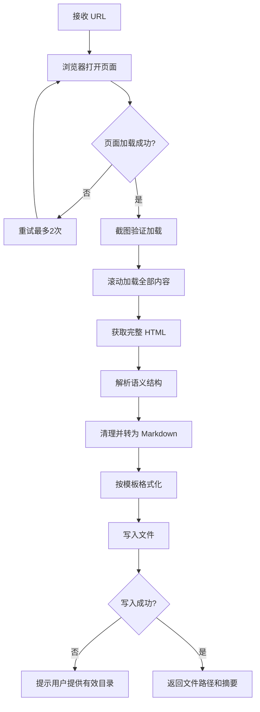

# Dynamic Page to Markdown

提取 JavaScript 动态渲染网页内容并保存为 Markdown 文档的技能。

## 功能概览

- 支持 JS 渲染页面的完整内容提取
- 自动识别页面结构（标题、段落、列表、代码块等）
- 输出格式规范的 Markdown 文件，包含来源链接和提取时间
- 通过 browser-use MCP 工具驱动真实浏览器，无 headless 限制

## 文件结构

```
dynamic-page-to-markdown/
├─ SKILL.md           # 技能核心说明（供 Mavis/Claude Code 读取）
├─ README.md          # 本文件
├─ .env.example       # 环境变量示例（本技能无需凭证）
├─ .gitignore         # Git 忽略配置
└─ references/        # （预留，暂无子文件）
```

## 安装

### 方式一：通过 Mavis 导入

将本目录作为技能安装到 Mavis：

```powershell
mavis skill install <本地路径>
```

### 方式二：通过 Claude Code 使用

将本目录放入 Claude Code 的 skills 扫描路径即可自动识别。

### 方式三：通过 GitHub 仓库安装

```bash
git clone https://github.com/JasonCai2024/dynamic-page-to-markdown.git
```

## 前置依赖

- **browser-use MCP** 已配置并运行（端口 9222，驱动 Edge 浏览器）
- Mavis 或 Claude Code 运行时环境

> 注意：本技能不依赖任何外部 API 或凭证，无需配置 `.env`。

## 核心设计决策

| 决策 | 说明 |
|------|------|
| 工具选型 | 优先使用 `browser_navigate` + `browser_get_html` 而非 `browser_extract_content`，确保获取真实 DOM |
| 内容提取 | 从 HTML 结构中识别语义容器（`<main>`, `<article>` 等），而非纯文本拼接 |
| 滚动加载 | 显式滚动步骤以触发懒加载内容，避免截断 |
| 格式模板 | 固定包含来源 URL、提取日期、AI 免责声明，保证引用可追溯 |
| 回退策略 | HTML 解析失败时降级到 `browser_extract_content`，仍失败则提供手动保存指引 |

## 工作流程



## 调用示例

```
Extract this page to Markdown: https://example.com/article
Save the content from this dynamically loaded page
Scrape this JS-rendered webpage and save as markdown
```

## 凭证安全

本技能**不涉及任何外部 API 调用**，不存储、不使用任何敏感凭证。
`.env.example` 文件仅作为规范占位，实际运行无需任何环境变量。

## 参考链接

- [Claude Code 技能文档](https://code.claude.com/docs/en/skills)
- [Anthropic 官方 Skills 示例](https://github.com/anthropics/skills)
